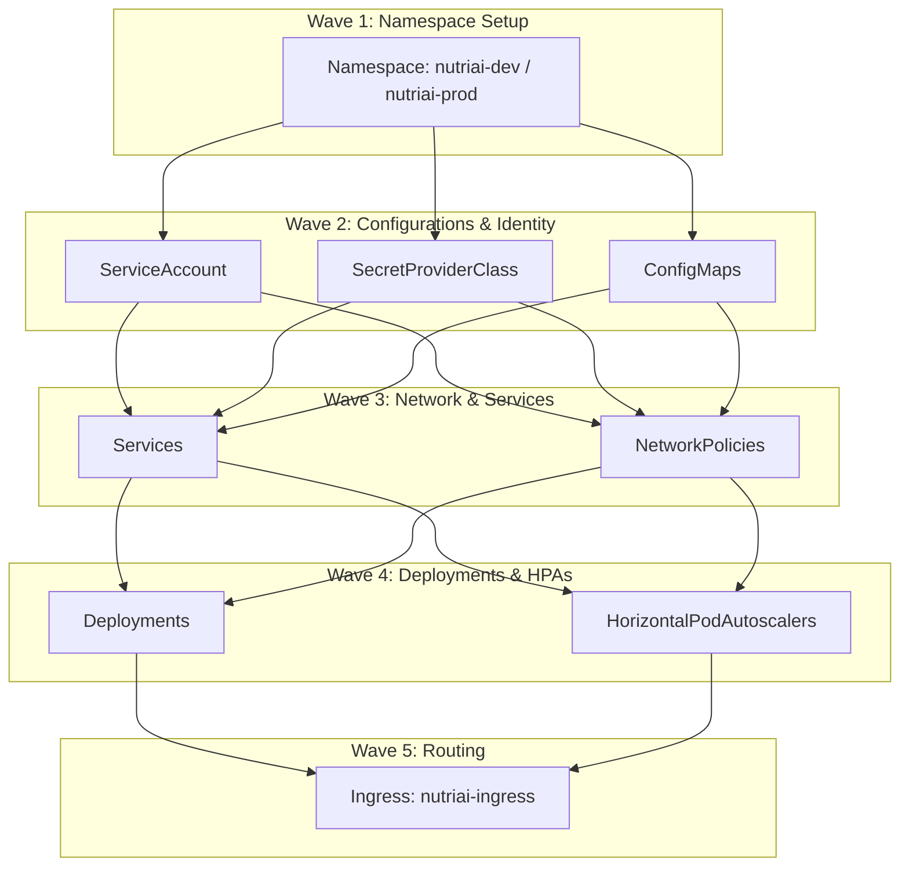

# NutriAI — Kubernetes Manifests & GitOps Repository

This repository contains the Kubernetes manifests, unified **Helm charts**, and **ArgoCD App-of-Apps bootstrap configurations** used to deploy the NutriAI microservices platform to **Azure Kubernetes Service (AKS)**.

---

## 📂 Repository Directory Structure

```
NutriAI-manifests/
├── argocd/                     # ArgoCD App-of-Apps bootstrap manifests
│   ├── dev/                    # Development environment bootstrap
│   └── prod/                   # Production environment bootstrap
├── helm/                       # Unified Helm Chart configurations
│   └── nutriai/                # NutriAI Chart folder
│       ├── Chart.yaml          # Helm Chart metadata
│       ├── values-dev.yaml     # Dev values configuration (image tags, replicas)
│       └── values-prod.yaml    # Prod values configuration
└── k8s/                        # Raw/Static Kubernetes manifest files
    ├── dev/                    # Static manifests for the development environment
    └── prod/                   # Static manifests for the production environment
```

* **`k8s/`**: Holds raw manifests used for manual deployments or bootstrapping. Includes service definitions, network policies, secret providers, and deployment specs.
* **`helm/`**: Used by ArgoCD in GitOps flows. Unifies all 9 microservices under a single Helm chart, injecting properties dynamically.
* **`argocd/`**: Implements the declarative App-of-Apps pattern, allowing a single root bootstrap application to deploy and reconcile the entire stack.

---

## 🏗️ Sync Wave Architecture

To ensure zero-downtime and clean rollouts, resource deployments are organized into **ArgoCD Sync Waves**. This prevents application pods from starting before their prerequisites (like namespaces, configmaps, and secrets) are active.



| Wave | Resource Kind | Target Action / Purpose |
| :--- | :--- | :--- |
| **Wave 1** | `Namespace` | Creates target namespaces before any resource runs. |
| **Wave 2** | `ServiceAccount`, `SecretProviderClass`, `ConfigMap` | Imports Key Vault secrets, creates identity bindings, and loads configuration maps. |
| **Wave 3** | `Service`, `NetworkPolicy` | Pre-provisions connection endpoints and firewalls. |
| **Wave 4** | `Deployment`, `HorizontalPodAutoscaler` | Deploys pod replicas and binds container configurations. |
| **Wave 5** | `Ingress` | Creates ingress rules to direct external traffic to services. |

---

## 🚀 Deployment Instructions

You can deploy the manifests manually using `kubectl` or automatically using ArgoCD GitOps.

### Option A: Manual Deployment (via Azure Cloud Shell / CLI)
Run these commands in order from the root of the repository to deploy to the development namespace:
```bash
# 1. Connect to AKS
az aks get-credentials --resource-group <rg-name> --name <aks-name>

# 2. Change directory
cd k8s/dev

# 3. Apply resources in wave order
kubectl apply -f namespace.yaml
kubectl apply -f service-account.yaml
kubectl apply -f secret-provider.yaml
kubectl apply -f network-policies.yaml
kubectl apply -f configmaps.yaml
kubectl apply -f services.yaml
kubectl apply -f deployments.yaml
kubectl apply -f ingress.yaml
```

---

### Option B: GitOps Bootstrapping (via ArgoCD)

#### Step 1: Install Argo CD on the Cluster
```bash
kubectl create namespace argocd
kubectl apply -n argocd -f https://raw.githubusercontent.com/argoproj/argo-cd/stable/manifests/install.yaml
```

#### Step 2: Deploy the Bootstrap App
Deploy the bootstrap application which watches this repository and automatically synchronizes the rest of the stack:

* **For Development (`dev` environment)**:
  Watches the `dev` branch. Sets **Auto-Sync** and self-healing.
  ```bash
  kubectl apply -f https://raw.githubusercontent.com/NutriAI16-ORG/NutriAI-manifests/main/argocd/dev/bootstrap.yaml
  ```

* **For Production (`prod` environment)**:
  Watches the `main` branch. Requires **Manual Sync** triggers for deployment safety.
  ```bash
  kubectl apply -f https://raw.githubusercontent.com/NutriAI16-ORG/NutriAI-manifests/main/argocd/prod/bootstrap.yaml
  ```

---

## 🔐 HTTPS & SSL Setup

For production routing and TLS termination at the Azure Application Gateway, follow [expose_https_guide.md](file:///c:/Users/YASWANTH/cloudtrack_final/NutriAI-manifests/expose_https_guide.md) to generate wildcard SSL certificates, upload them to Key Vault, and configure AGIC.
