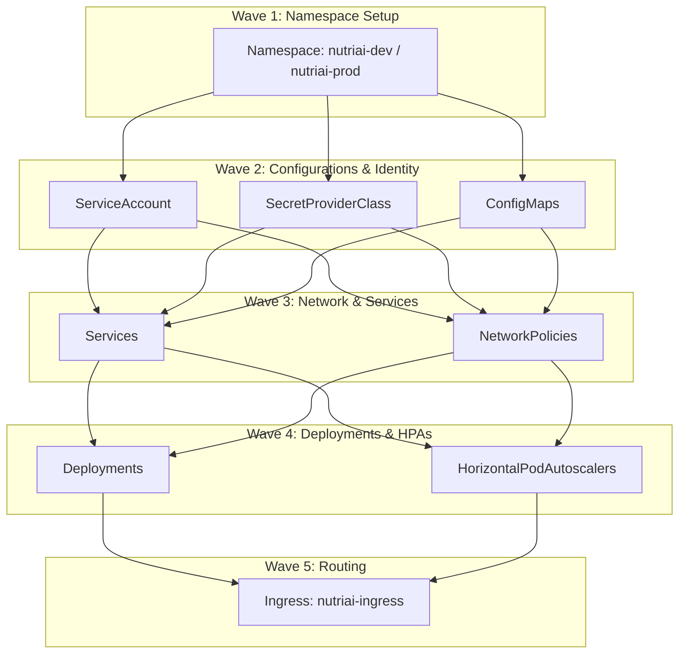

# Argo CD GitOps Bootstrap Guide — NutriAI

This directory contains the Argo CD declarative **App-of-Apps** (umbrella) bootstrap configuration for the NutriAI platform, supporting both development and production environments.

---

## 🏗️ Sync Wave Architecture

To ensure zero-downtime and clean rollouts, resources are orchestrated using **Argo CD Sync Waves**. This prevents pods from starting before their prerequisites (like ConfigMaps and secrets) are ready.



| Wave | Resource Kind | Target Action / Purpose |
| :--- | :--- | :--- |
| **Wave 1** | `Namespace` | Creates target namespaces before any resource runs. |
| **Wave 2** | `ServiceAccount`, `SecretProviderClass`, `ConfigMap` | Imports Key Vault secrets, creates identity bindings, and loads configuration maps. |
| **Wave 3** | `Service`, `NetworkPolicy` | Pre-provisions connection endpoints and firewalls. |
| **Wave 4** | `Deployment`, `HorizontalPodAutoscaler` | Deploys pod replicas and binds container configurations. |
| **Wave 5** | `Ingress` | Creates ingress rules to direct external traffic to services. |

---

## 🚀 Cluster Deployment Steps

Follow these instructions in your local terminal (e.g., Azure Cloud Shell or VM jumpbox) to deploy Argo CD and bootstrap the application.

### Step 1: Install Argo CD on the Cluster
Run the following commands to install Argo CD in the cluster:
```bash
# 1. Create the argocd namespace
kubectl create namespace argocd

# 2. Apply the community manifest to install Argo CD
kubectl apply -n argocd -f https://raw.githubusercontent.com/argoproj/argo-cd/stable/manifests/install.yaml
```

### Step 2: Access the Argo CD Dashboard (Optional)
To log in and view the visual dashboard:
```bash
# Port-forward the dashboard UI locally
kubectl port-forward svc/argocd-server -n argocd 8080:443

# Get the initial admin password to log in:
kubectl -n argocd get secret argocd-initial-admin-secret -o jsonpath="{.data.password}" | base64 -d
```

---

## 🛠️ Bootstrapping the Application

### A. Development Environment (`dev`)
* **Branch watched:** `dev`
* **Sync Strategy:** **Auto-Sync** (Automatically syncs changes, prunes resources, and self-heals drifting values).

Deploy the root bootstrap application:
```bash
kubectl apply -f https://raw.githubusercontent.com/NutriAI16-ORG/NutriAI-manifests/main/argocd/dev/bootstrap.yaml
```
Argo CD will automatically create the `nutriai-dev` namespace and roll out the Helm chart templates in order of their sync waves.

### B. Production Environment (`prod`)
* **Branch watched:** `main`
* **Sync Strategy:** **Manual Sync** (Requires manual trigger or click in UI/CLI to deploy updates, ensuring safety audits).

Deploy the root bootstrap application:
```bash
kubectl apply -f https://raw.githubusercontent.com/NutriAI16-ORG/NutriAI-manifests/main/argocd/prod/bootstrap.yaml
```
The bootstrap app will register the `nutriai-prod` application. Once verified, trigger the manual sync from the Argo CD UI or via CLI:
```bash
argocd app sync nutriai-prod-app
```
